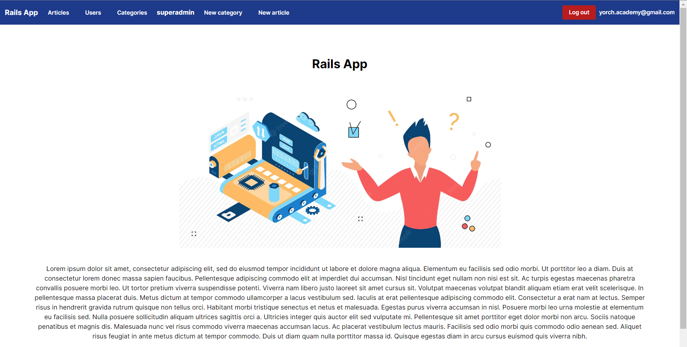
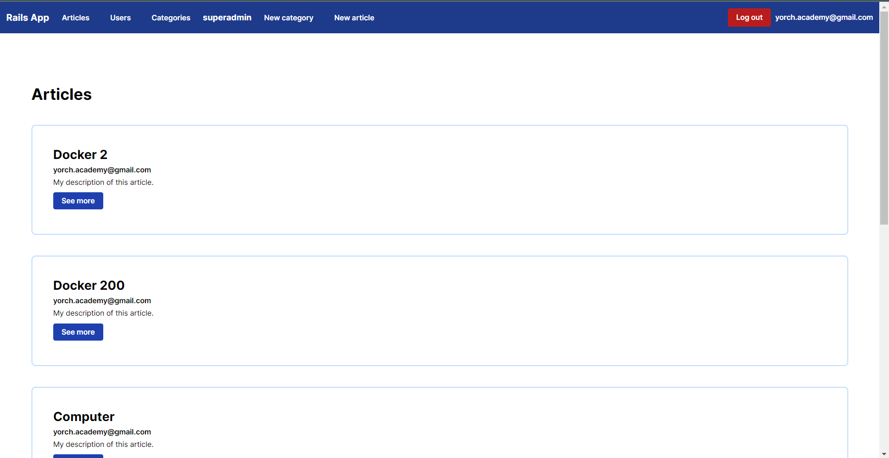
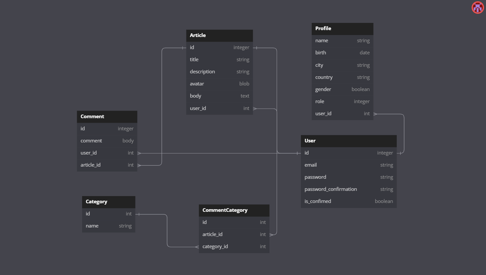

# Omega Blog - Ruby on Rails, Docker and Microsoft Azure.

This is the Omega Blog App, where users can create articles and categories.
They also can leave their own comments and images ande files on each article. Images and files are been saved using
Microsoft services such as buckets.
You can visit this web application by clicking on the next below to see more about it.

## Link
In this section, you will find link to visit this web application.
https://omega-blog-container.whitegrass-3bec7435.centralus.azurecontainerapps.io/

## 3° Services.

- Sendgrid.

As a user, I need to create my own account in this web application. After create my account, an email will be sent to my email account to validate my information.
For sending email in production, the Omega Blog is useing Sendgrid.
To get more information about Sengrid, you can click on the next link: https://sendgrid.com/

- Microsoft Azure.

Images and files are saved within Microsoft Azure services. A bucket was created and confiured to make this possible.
You can click on the next links to get more information about Bucket's configuration and Active Storage. Besides, a docker container has been created to access to this app. https://azure.microsoft.com/es-es/

## Database diagram.

This is the DB diagram where contains all the tables and attributes implemented in this web application

## softwares

- Ruby on Rails 7.
- PostgreSQL.
- Docker.
- Docker Hub.
- Microsoft Azure.
- VS Code.
- TailwindCSS

## Author

- Jorge Ortiz.
- ortiz.mata.jorge@gmail.com
- yorch.academy@gmail.com
- LinkedIn: https://www.linkedin.com/in/jorge-ortiz-ab1b18183/
